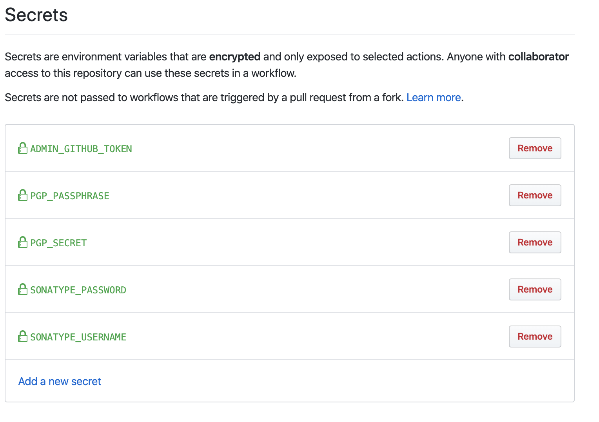

# Github Action powered service to spread secrets across repositories

Repository for setting up GitHub Actions Secrets Management using [webfactory/secret-spreader](https://github.com/webfactory/secret-spreader).

---

- [How does this work?](#how-does-this-work)
- [What secrets are available?](#what-secrets-are-available)
- [Configuration Matrix](#configuration-matrix)
- [How to add a new secret?](#how-to-add-a-new-secret)
- [How to add a new repository?](#how-to-add-a-new-repository)
- [Removing a secret](#removing-a-secret)
- [How to trigger spreading?](#how-to-trigger-spreading)

## How does this work?

Secrets are safely stored under [`47degrees/sonatype-secrets` secrets](https://github.com/47degrees/sonatype-secrets/settings/secrets).

Whenever a new repository is added to the list, a Github Action is triggered that will spread all secrets across the configured repos in [`spreaded-secrets.yml`](https://github.com/47degrees/sonatype-secrets/blob/master/spreaded-secrets.yml).

## What secrets are available?

Right now, the only available secrets are those needed for a Scala release through [`sbt-ci-release`](https://github.com/olafurpg/sbt-ci-release#travis), and those to create automated PRs (update docs files, changelog, etc.):



## Configuration Matrix

Additionally, apart from the secrets, we are propagating some boolean settings to be able to centralize the Github actions that are optionally going to run in every repository. Depending on where they are used, if they are present in the repository, the action will run. These are:

- `REQUIRES_JEKYLL_CI`: some projects, like sbt-microsites requires jekyll installed to be able to run the tests.
- `REQUIRES_PUBLISH_MICROSITE`: if specified, in every release, the microsite will be published.

## How to add a new secret?

1. Add it as you would normally do in any repository through [settings page](https://github.com/47degrees/sonatype-secrets/settings/secrets).
2. Edit [`.github/workflows/spread-secrets.yml`](https://github.com/47degrees/sonatype-secrets/edit/master/.github/workflows/spread-secrets.yml) workflow and add the following line:

    ```diff
    name: Update secrets
    shell: bash
    run: |
      echo -n ${{ secrets.PGP_PASSPHRASE }} | bin/encrypt > PGP_PASSPHRASE
      echo -n ${{ secrets.PGP_SECRET }} | bin/encrypt > PGP_SECRET
      echo -n ${{ secrets.SONATYPE_PASSWORD }} | bin/encrypt > SONATYPE_PASSWORD
      echo -n ${{ secrets.SONATYPE_USERNAME }} | bin/encrypt > SONATYPE_USERNAME
    + echo -n ${{ secrets.YOUR_SECRET_NAME }} | bin/encrypt > YOUR_SECRET_NAME
    ```

3. Check if any repositories need to receive the new secret, if this is the case, edit [`spreaded-secrets.yml`](https://github.com/47degrees/sonatype-secrets/edit/master/spreaded-secrets.yml) and add the secret to those repos:

    ```diff
    repositories:
      47degrees/your_repo_name:
        PGP_PASSPHRASE: PGP_PASSPHRASE
        PGP_SECRET: PGP_SECRET
        SONATYPE_USERNAME: SONATYPE_USERNAME
        SONATYPE_PASSWORD: SONATYPE_PASSWORD
    +   YOUR_SECRET_NAME: YOUR_SECRET_NAME
    ```

## How to add a new repository?

Just add it to `spreaded-secrets.yml`:

```diff
 public-key: {{public-key}}
 repositories:
+    47degrees/your_repo_name:
+        PGP_PASSPHRASE: PGP_PASSPHRASE
+        PGP_SECRET: PGP_SECRET
+        SONATYPE_USERNAME: SONATYPE_USERNAME
+        SONATYPE_PASSWORD: SONATYPE_PASSWORD
```

## Removing a secret

If you want to remove a particular secret from a repository, use `~` as the filename for it, like so:

```diff
 public-key: {{public-key}}
 repositories:
    47degrees/your_repo_name:
        PGP_PASSPHRASE: PGP_PASSPHRASE
        PGP_SECRET: PGP_SECRET
        SONATYPE_USERNAME: SONATYPE_USERNAME
        SONATYPE_PASSWORD: SONATYPE_PASSWORD
-       YOUR_SECRET_NAME: YOUR_SECRET_NAME
+       YOUR_SECRET_NAME: ~
```

Try this and remove the DEMO secret from your config repository.

## How to trigger spreading?

Adding a new repository will automatically trigger spreading of all secrets to all repositories. 

On the other hand, after updating a secret, you can trigger spreading by executing the following command from your local machine:

```
curl -d "{\"event_type\": \"secrets\"}" -H "Content-Type: application/json" -H "Authorization: token ${GITHUB_TOKEN}" "https://api.github.com/repos/47degrees/sonatype-secrets/dispatches"
```

> Remember to have a valid github token exported as `GITHUB_TOKEN` in your local environment:
>
> ```bash
> export GITHUB_TOKEN="your_github_token"
> ```
